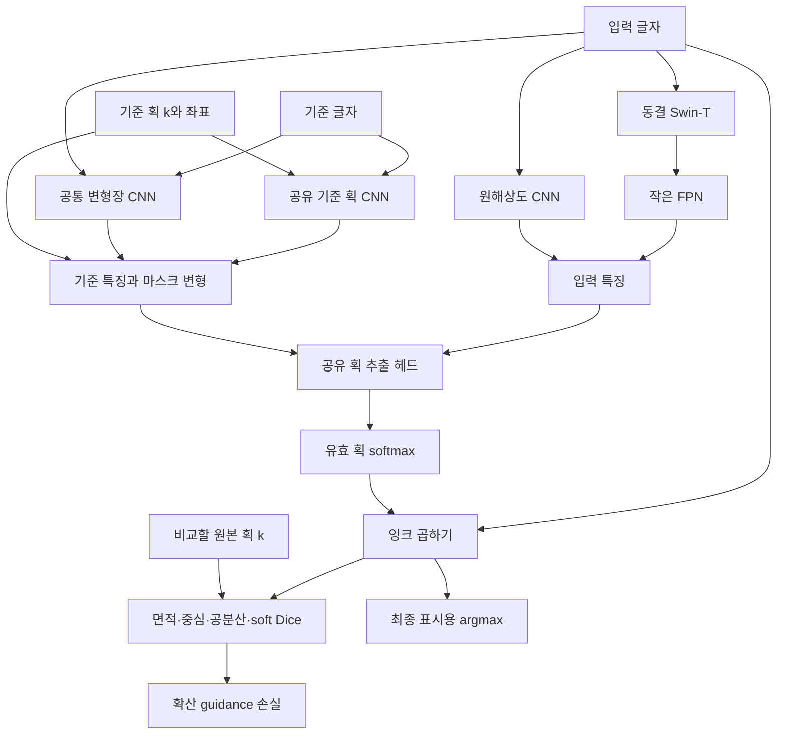
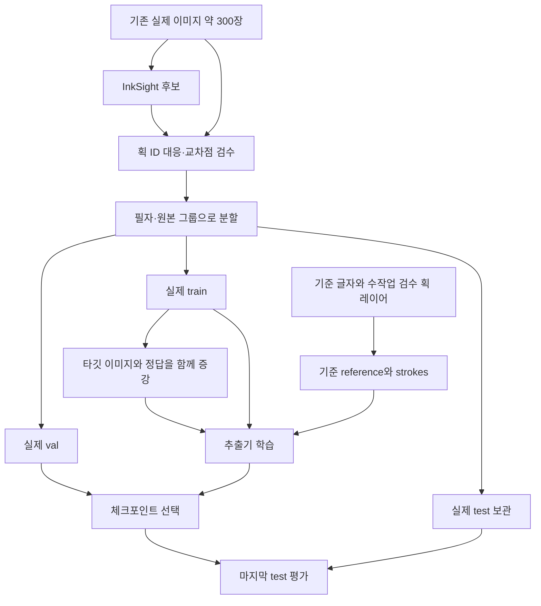

# 기준 획 조건부 모델 V2 — 구현과 데이터 계획

2026-09-19. 연구용 첫 구현이며 실제 데이터 학습/성능 검증 전이다.
기존 BiFPN 모델과 체크포인트를 대체하지 않는다. 기존 가중치를 V2에 그대로 로드할 수 없다.

## 선택한 구조

- 입력: 글자 `image`, 기준 글자 `reference`, 기준 획 `strokes[k]`. 모두 128×128, 잉크=1/배경=0.
- ImageNet 사전학습 Swin-T는 기본 동결. 내부에는 흰 배경 RGB로 변환하고 pretrained_cfg의 mean/std를 적용한다.
- FPN 폭 64 + 원해상도 CNN 분기. 작은 데이터/배치에 맞춰 새 모듈은 BatchNorm 대신 GroupNorm 사용.
- 기준 글자와 입력 글자에서 작은 CNN이 공통 flow를 예측. ±12px 범위의 초기 실험값이다.
- 각 획마다 [기준 글자, 선택한 획, 좌표]를 같은 CNN으로 처리. 공간 특징과 마스크를 flow로 변형.
- 입력 특징과 기준 획 특징·힌트를 공유 헤드에 넣어 획별 점수를 출력한다. 별도 획 번호 임베딩은 없다.
- 유효한 획들 사이의 softmax p. soft mask M=image*p. 합은 입력 잉크와 같지만 soft mask 자체는 배타적이지 않다.
- `exclusive_masks`는 제공한 foreground 내에서만 최종 argmax 배정. 확산/학습 경로에는 사용하지 않는다.
- 학습: annotated foreground CE + annotated nonempty stroke soft Dice + 0.001 flow smoothness.
- 추출기가 모양 차이를 숨기지 않도록, 비교 지표는 최종 입력 좌표계의 출력 마스크에서 계산한다. flow로 원본을 재정렬한 결과를 최종 평가 대상으로 삼지 않는다.



## 데이터: 사람이 할 일과 자동화할 일

1. **획 정의 고정**: pen-down 한 번과 교과서적 획이 다를 수 있다. 분석 단위를 먼저 고정한다. 같은 글자의 기준/타깃은 동일한 stroke_id를 사용한다. 누락 획을 빈 패딩과 혼동하지 않는다.
2. **기준 묶음 제작**: 실제 대상이 6글자라면 우선 각 글자별 기준 이미지 1개와 획 레이어를 수작업 검수. '6종류'가 필체라면 글자별로 각각 필요하다. SVG 레이어 또는 획별 PNG를 사용한다. 일반 폰트 윤곽선은 곧바로 획 정답이 아니다.
3. **실제 300장 정리**: 원본 이미지 보존. InkSight 자동 결과는 후보로만 사용. 획 수·순서·대응을 수정하고 심한 실패는 제외한다. 작은 검수 묶음부터 시작해 확대한다. 새로운 필기를 받을 수 있다면 처음부터 태블릿 좌표/pen-up 기록을 저장하면 사후 분해 작업을 줄일 수 있다. 기록된 pen stroke도 기준 획 ID에 매핑해야 한다.
4. **분할 먼저**: 필자 또는 원본 출처(group_id) 기준 train/val/test. 70/15/15는 시작 예시이며 그룹 수에 맞게 조정한다. 동일 원본·증강 형제·같은 필자의 이미지가 여러 split에 섞이지 않도록 한다. 같은 글자 대상 성능과 미관측 글자 일반화는 별도 실험이다. 6글자만 학습하고 전체 한글 성능을 주장할 수 없다.
5. **교차점 규약**: 최종 foreground 픽셀은 소유 획 ID 하나. 실제 데이터에서 확신 없는 교차점은 `-1`로 두고 학습에서 제외 가능. 이는 추론 시 미할당을 허용한다는 뜻이 아니다. 검증/test는 가능하면 전체 전경을 검수해 할당한다. 폴리라인 합성은 고정된 그리기 순서로 나중 획 소유처럼 일관된 규약을 기록한다. 이 규약을 실제 교차점에도 적용한다. 겹침 없는 분할은 일부 획의 연결성을 끊을 수 있다.
6. **자동 증강**: 학습 원본의 이미지와 label map에 같은 affine/elastic 변형, 기준 글자/기준 획은 고정. `augment_reference.py` 구현 범위는 회전±10°, scale 0.92–1.08, 작은 이동·탄성 변형·잉크 농도 변화. 좌우 반전/cross-character mixup은 사용하지 않는다. 시작은 원본당 20개, 검증으로 조정. 이는 새로운 필자 20명을 확보한 것과 다르다.
7. **추가 합성(후속)**: 검수된 기준 획/온라인 폴리라인의 길이·폭·곡률을 변형해 rasterize하고 소유 label map을 동시에 생성. 현재 도구는 기존 검수 샘플의 증강이며 폰트/폴리라인 렌더러는 아직 구현하지 않았다. 합성이 실제 필체를 대체하지 않으므로 실제 val 점수로 사용량을 조절한다.



## 파일 형식

`data_v2/manifest.json`은 아래 객체의 리스트:

```json
[
  {"path":"samples/train_001.npz", "split":"train", "group_id":"writer_A", "char_id":"가", "source":"reviewed"},
  {"path":"samples/val_001.npz", "split":"val", "group_id":"writer_B", "char_id":"가", "source":"reviewed"},
  {"path":"samples/test_001.npz", "split":"test", "group_id":"writer_C", "char_id":"가", "source":"reviewed"}
]
```

각 npz: `image` float32 [1,128,128], `reference` float32 [1,128,128],
`strokes` float32 [K,128,128], `labels` int64 [128,128].
labels는 0..K-1의 기준 획 인덱스, -1은 background 또는 unknown.
K가 달라도 배치에서 패딩한다. 이미지/마스크는 [0,1].
기존 Gaussian target mask를 정답 소유 label로 곧바로 argmax 변환하면 오류를 굳힐 수 있으므로 검수 후 변환한다.
reference strokes는 겹칠 수 있으나 target labels는 한 픽셀 한 ID다.
배경/미검수 픽셀을 제외한 부분 평가가 전체 분할 정확도와 같지 않음을 기록한다.

## 실행

프로젝트 루트에서:

```bash
pip install -r requirements.txt
python -m unittest discover -s tests -v
python -m stroke_model.augment_reference --manifest data_v2/manifest.json --variants 20
python -m stroke_model.train_reference --manifest data_v2/augmented_seed42/manifest.json --epochs 30
```

best.pt는 `outputs/reference_v2/`에 저장. 기본 30 epochs/lr2e-4는 시작값이며 검증된 최적값이 아니다.
처음 Swin 사전학습 가중치 다운로드에 인터넷 필요. 작은 모듈 약 40.7만 파라미터만 학습.
원본 실제 train만 사용한 실험과 증강 사용 실험을 비교한다. 평가가 plateau라고 즉시 전체 Swin을 풀지 말고 라벨·힌트 의존/정답 대응부터 확인한다.
`train_reference`는 test를 선택에 사용하지 않는다. 최종 test는 `evaluate`와 동일 로더를 사용해 한 번 보고한다.

## 확산 연결

```python
from stroke_model.reference_model import ReferenceStrokeModel, stroke_moments
model = ReferenceStrokeModel(pretrained=False).to(device)
model.load_state_dict(checkpoint['model'])
model.eval().requires_grad_(False)
# x0_ink: 확산의 깨끗한 이미지 추정값을 미분 가능하게 [0,1] 잉크로 표현.
# latent diffusion이면 differentiable VAE decode도 이 경로에 포함한다.
out = model(x0_ink, reference, reference_strokes)
pred_stats = stroke_moments(out['masks'])
target_stats = stroke_moments(original_stroke_masks).detach()
selected = out['active'] & (original_stroke_masks.sum((-2, -1)) > 1e-6)
loss = (pred_stats[selected] - target_stats[selected]).square().mean()
# 이 loss에서 x0 및 필요한 diffusion 변수로 autograd를 전달한다.
```

예제는 통계의 동일 가중치 평균일 뿐, 실제 지표의 단위/중요도별 가중치는 후속 검증 대상.
공분산은 중심선 길이/실제 곡률이 아니다. 작은 질량의 획은 중심/공분산이 불안정하므로 면적과 함께 확인.
이미지 경로에 no_grad/detach/NumPy/threshold/argmax를 넣지 않는다. 기준 데이터만 미리 고정/캐시할 수 있다.
grid_sample은 1차 이미지 gradient를 지원하지만 고차미분 요구와 CUDA 재현성은 별도 검증 필요.
이 구현은 1차 guidance 경로를 위한 것으로 확산 모델을 관통하는 고차미분 지원을 약속하지 않는다.
노이즈 x_t를 직접 넣지 말고 x0 추정에 적용한다. guidance가 추출기 허점을 이용하지 않는지 사람 평가와 독립 지표로 확인한다.

## 근거와 한계

- [Swin, ICCV 2021](https://openaccess.thecvf.com/content/ICCV2021/html/Liu_Swin_Transformer_Hierarchical_Vision_Transformer_Using_Shifted_Windows_ICCV_2021_paper.html): 다중해상도 특징 추출.
- [PANet, ICCV 2019](https://openaccess.thecvf.com/content_ICCV_2019/html/Wang_PANet_Few-Shot_Image_Semantic_Segmentation_With_Prototype_Alignment_ICCV_2019_paper.html): 기준 이미지/마스크 조건부 분할의 근거. 본 구현은 PANet 재현이 아니며 prototype loss를 사용하지 않는다.
- [Stroke Extraction, AAAI 2023](https://ojs.aaai.org/index.php/AAAI/article/view/25220): 기준 획 등록·단일 획 추출 접근. 중국어 실험이며 한글 우수성을 보장하지 않는다.
- [Universal Guidance, 2023](https://arxiv.org/abs/2302.07121): 미분 가능한 지표로 확산을 유도하는 경로의 근거.
- [timm feature extraction](https://huggingface.co/docs/timm/feature_extraction): feature backbone API 확인.

현재 버전은 위 아이디어를 소규모 한글 데이터에 맞춰 조합한 제안이다. 실제 checkpoint/데이터를 학습하지 않았으며 정확도 개선은 아직 입증되지 않았다.

## 이번 구현의 확인 결과

- 기존 13개 + 새 모델/데이터 9개, 총 22개 단위 테스트 통과.
- timm 1.0.29 실제 Swin, pretrained=False에서 순전파, 학습 손실 역전파, 전체 추출기 고정 후 입력 gradient 확인.
- 파라미터 27,919,325개 중 학습 대상 407,267개. 가중치 동결은 diffusion guidance 메모리 사용을 없애는 것은 아니다.
- 테스트는 정확도/Colab 실제 학습/사전학습 가중치 다운로드 검증이 아니다.
- `notebooks/train_reference_v2.ipynb`는 5개 실행 셀. 첫 셀은 `https://github.com/yechan25/hsqm.git`에서 코드를 받고 버전을 출력한다. 두 번째 셀은 알려진 Drive의 `HSQM/dataset/train_dataset/paths.csv`를 자동 변환한다. 이후 train 증강, 학습, 검증 결과 표시 순서다. ZIP/manifest 수동 입력은 필요 없다.
- `python tests/build_reference_bundle.py`로 현재 소스의 ZIP과 노트북을 재생성할 수 있다.
- 원본 비교 마스크도 동일한 교차점 소유 규약을 적용해야 면적/모양 지표에 정의 차이가 섞이지 않는다.

## 기존 CSV 자동 변환

`convert_reference_csv.convert_csv`는 CSV의 기준 획 목록과 타깃 획 목록이 동일 순서라고 가정한다.
의미적인 획 대응을 새로 추측하지 않는다. 획 개수 불일치, 빈 기준 획, 파일 누락/모호한 경로는 행 번호와 함께 중단한다.
배경 밝기로 극성을 판별하고 투명 PNG는 흰 배경에 합성한다. 비표준 극성은 변환 미리보기에서 확인한다.
target mask > 0.5이며 image > 0.5인 단독 소유 픽셀만 라벨링한다. 교차/누락은 -1로 두며
`conversion_report.json`에 커버리지/겹침/누락을 기록한다. 따라서 자동 변환 직후 val Dice는 **주석된 부분의 점수**이며 교차점 전체 성능을 보장하지 않는다.
필자/group 컬럼이 있으면 그룹 단위, 없으면 정규화한 입력 이미지 해시 단위로 80/20 분리한다.
동일 원본 복제는 분할을 공유하지만, 필자 ID가 없을 때 필자 누수를 방지한다고 주장할 수 없다.
train CSV만 사용하며 기존 test_dataset은 모델 선택에 사용하지 않는다.
Drive `HSQM/reference_v2_data/시간/` 아래 새 데이터와 결과를 저장하며 원본 CSV/이미지는 변경하지 않는다.
재실행 시 새 변환/증강 폴더를 만들어 이전 결과를 덮어쓰지 않는다.
